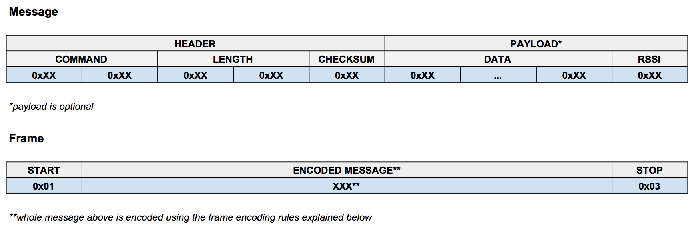

# Protocol

This document is here to lay out the communication protocol used by the Zigate.  
The Zigate communicates via a **PL2303HX** Serial interface module.

Requirements:  
Install your PL2303HX driver on your system.
 * Linux (built-in since kernel 2.6)
 * [Windows](http://www.prolific.com.tw/US/ShowProduct.aspx?p_id=225&pcid=41)
 * [Mac OS/X](http://www.prolific.com.tw/US/ShowProduct.aspx?p_id=229&pcid=41)

NB :
 * `"^" is the XOR operator`
 * All multi-byte values are **big-endian**



## Messages

All Zigate Messages contain :
 * a command-code
 * a payload (optional)

### Serialization
As all Zigate messages are Serial messages, they can be serialized in the following form :

**Header**

| COMMAND | LENGTH | CHECKSUM |
| --- | --- | --- |
| 2 bytes | 2 bytes | 1 byte |

 * **COMMAND** : the command code. Value *C* is anything between `0x0000` and `0xffff`
 * **LENGTH** : the total length of the payload. Value *N* is anything btw `0x0000` and `0xffff`
 * **CHECKSUM** : 1 byte, computation method explained below.

**Payload**
**Beware**, the payload is **optional**. When no payload is provided, neither DATA nor RSSI will be sent.

| DATA | RSSI |
| --- | --- |
| N-1 bytes | 1 byte |

 * **DATA** : N-1 bytes (N is btw 0 and 0xffff)
 * **RSSI** : 1 byte btw `0x00` and `0xff`

*NB : When data comes from a remote Zigbee device, RSSI is usually present and between 0x01 and 0xff. When data comes directly from the Zigate, RSSI is also usually present with a value of 0x00.*

### Checksum
To compute the checksum, use the following steps:

 * Let C1 and C2 be the two bytes representing the COMMAND.
 * Let L1 and L2 be the two bytes representing the LENGTH.
 * Let Pi be the PAYLOAD byte at index i

*Examples:*
 * if COMMAND is 0x8000, C1=0x80 and C2=0x00
 * if LENGTH is 0x0005, L1=0x00 and L2=0x05
 * if PAYLOAD is 0x00000010, P1=0x00, P2=0x00, P3=0x00, P4=0x10

The checksum can be computed this way:  
`CHECKSUM=C1 ^ C2 ^ L1 ^ L2 ^ P1 ^ P2 ^ ... ^ Pi ^ RSSI`

If there is no payload, checksum can be computed this way:  
`CHECKSUM=C1 ^ C2 ^ L1 ^ L2`

*Example:*
 * COMMAND: 0x8000
 * LENGTH: 0x0005
 * PAYLOAD: 0x00000010
 * RSSI: 0x00

`CHECKSUM = 0x80 ^ 0x00 ^ 0x00 ^ 0x05 ^ 0x00 ^ 0x00 ^ 0x00 ^ 0x10 ^ 0x00 = 0x95`

## Frame encoding

When sending a message (outbound OR inbound), it needs to be encoded this way :
 * **START** : 1 byte, value is always `0x01`
 * **ENCODED** FRAME : see encoding below
 * **STOP** : 1 byte, value is always `0x03`

The encoding is the following:  

Let **B** any byte value of the message.
If B is between `0x00` and `0x0f` (included) then :
 * Instead of B, a 2-byte content will be written in the encoded frame
 * The first byte is a fixed value: `0x02`
 * The second byte is the result of B ^ 0x10

### Example
 * To encode 0x0a, you will write 0x02 0x1a on the serial link
 * To encode 0x10, you will write 0x10 on the serial link
 * To encode 0x05, you will write 0x02 0x15 on the serial link

### Sample implementation

Encode:
```javascript
// b is a byte to write on the serial link
function writeOnWire(link, b) {
  if (b < 0x10) {
    link.writeByte(0x02);
    link.writeByte(b ^ 0x10);
  } else {
    link.writeByte(b);
  }
}
```

Decode:
```javascript
// looking to read the next byte from the serial link
function readFromWire(link) {
  let b = link.readNextByte();
  if (b === 0x02) {
    return link.readNextByte() ^ 0x10;
  }
  return b;
}
```

# Examples

## Example 1 : Outbound

Outbound Message :
 * Code : 0x0010
 * Length : 0x0000
 * Checksum : 0x00 ^ 0x0010 ^ 0x0000 = 0x10

Resulting Frame :
 * Start : 0x01
 * Code : 0x0210 0x10
 * Length : 0x0210 0x0210
 * Checksum : 0x10
 * Stop : 0x03

This frame has no Payload (no data, no RSSI)

Bytes written on link : **01 02 10 10 02 10 02 10 10 03**

## Example 2 : Inbound

Incoming Frame :
 * Start : 0x01
 * Code : 0x80 0x0210
 * Length : 0x0210 0x0215
 * Checksum : 0x95
 * Data : 0x0210 0x0210 0x0210 0x10
 * RSSI : 0x0210
 * Stop : 0x03

Bytes read on link : **01 80 02 10 02 10 02 15 95 02 10 02 10 02 10 10 02 10 03**

Decoded Incoming Frame :
 * Start : 0x01
 * Code : 0x80 0x00
 * Length : 0x00 0x05
 * Checksum : 0x95
 * Data : 0x00 0x00 0x00 0x10
 * RSSI : 0x00
 * Stop : 0x03

Inbound Message :
 * Code : 0x8000
 * Length : 0x0005
 * Checksum : 0x95 = 0x00 ^ 0x80 ^ 0x00 ^ 0x00 ^ 0x05 ^ 0x00 ^ 0x00 ^ 0x00 ^ 0x10 ^ 0x00
 * Data : 0x00000010
 * RSSI : 0x00
